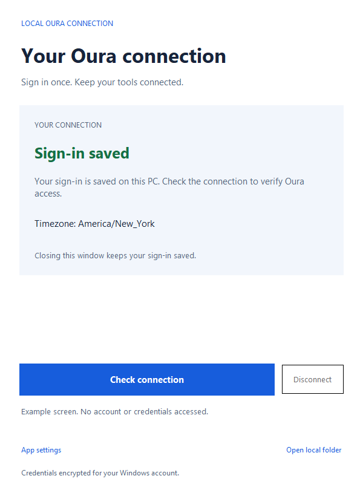

# Oura Connector

Self-hosted, open-source software for reading your own Oura data. Clone this repository, create your own Oura developer application, and run the connector on your computer with your own credentials. The maintainer provides the code; there is no shared developer app, hosted account, or maintainer-operated data service.

Retrieve a day, a date range, a collection, or one record through six MCP tools or an optional HTTP API. Both interfaces use the same Python service.

The connector retrieves Oura's measurements and scores. It adds readable names and units, preserves separate sleep periods, and reports missing or incomplete data. There is no analytics, coaching, weekly comparison, Sheets integration, or background sync.

## Quick start

Requires Python 3.11+ and [uv](https://docs.astral.sh/uv/). Verified on Windows x64 with Python 3.12.

```powershell
git clone https://github.com/whuang214/oura-connector.git
cd oura-connector
uv sync --locked
uv run oura-connector ui
```

Create an [Oura OAuth application](https://developer.ouraring.com/applications) first. Follow the [portal field guide](docs/app-registration.md) for the name, description, policy URLs, permissions, and screenshots. Register `http://localhost:8765/callback` as its redirect URI. The window asks for your client ID and secret once, then opens Oura in your browser. Your Oura password stays on Oura's website. Windows encrypts the saved credentials for your account.

Settings and credentials live outside the repository, under `%LOCALAPPDATA%/oura-connector` on Windows or `$XDG_CONFIG_HOME/oura-connector` (default `~/.config/oura-connector`) elsewhere. The connector does not read `.env` files.

Every person running a copy registers their own developer app and uses their own contact details. Never request, share, or reuse the maintainer's client secret. See [Self-hosting responsibilities](docs/self-hosting.md), [Privacy Policy](PRIVACY.md), and [Terms of Service](TERMS.md). Software rights are governed by the [MIT license](LICENSE), including its warranty and liability disclaimer. This is a community project, with no support or availability guarantee.

## Oura Connect window

| First-time setup | Saved connection |
| --- | --- |
|  |  |

Close the window to keep your sign-in. Reopen it to see the saved connection, check Oura access, or disconnect locally. Disconnect removes this app's OAuth tokens; your Oura data and app setup remain. Screenshots use synthetic details.

Create a desktop shortcut on Windows:

```powershell
pwsh -NoProfile -File scripts/create-shortcut.ps1
```

The shortcut opens **Oura Connect** without a terminal window. The CLI setup/login commands remain available. Complete app setup before starting your MCP client; restart it after changing app credentials.

## Connect an MCP client

Add a local stdio server using your client's supported MCP configuration:

```json
{
  "mcpServers": {
    "oura": {
      "command": "uv",
      "args": ["run", "--locked", "--directory", "C:/path/to/oura-connector", "oura-connector", "mcp"]
    }
  }
}
```

Replace the directory with your checkout. No HTTP server is needed. If your client cannot find uv, use its absolute executable path.

| Tool | Purpose |
| --- | --- |
| `oura_get_day` | One explicit Oura date, with selectable sections |
| `oura_get_days` | Up to 31 inclusive dates, with no aggregation |
| `oura_get_records` | A collection with bounded, resumable pagination |
| `oura_get_record` | One source record by ID |
| `oura_resources` | Resource names, filters, fields, units, and known scopes |
| `oura_status` | Local date, timezone, and sanitized credential status |

Example arguments: `{"date":"2026-09-27","include":["sleep","readiness"]}`. Default sections are sleep, readiness, activity, stress, and SpO2. Use `"format":"source"` for full upstream records.

## Optional HTTP API

```powershell
uv run oura-connector serve
```

The API listens on `127.0.0.1:8766`. `/health` reports process liveness; other routes require `Authorization: Bearer <http_token>`. Setup generates that token in protected `credentials.json`. Keep it in your HTTP client's secret storage. Browser-origin requests are rejected.

## Customize and develop

Edit your non-secret `config.toml`; see [example settings](examples/config.toml). Change default sections, compact source-field selection, timezone, or operational limits.

```powershell
uv sync --locked --extra dev
uv run --locked pytest
uv run --locked ruff check .
uv run --locked mypy
uv build
```

[Setup and security](docs/setup.md) · [Data and sleep behavior](docs/data.md) · [Architecture and development](docs/development.md) · [Approved design](docs/design.md)

Tests use synthetic data and mock Oura responses. Live account verification is a separate step. The connector adds no hosted service fee; Oura controls account/device eligibility and API access.
