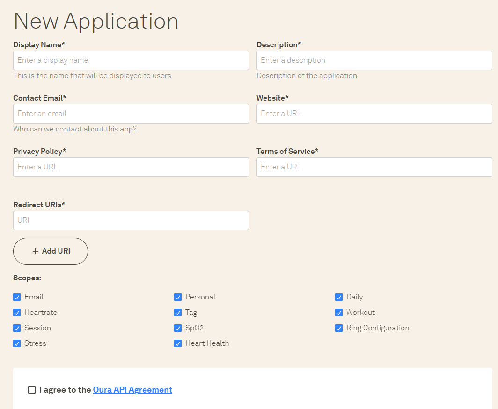
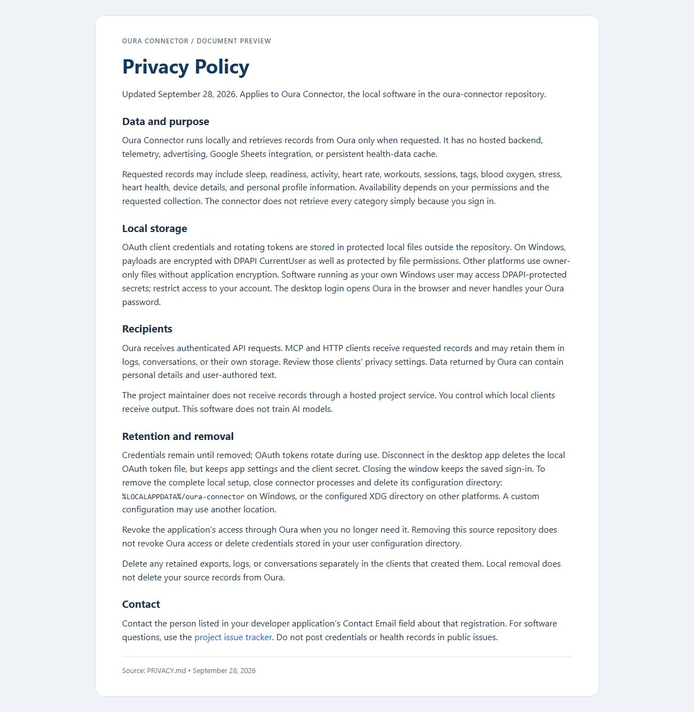
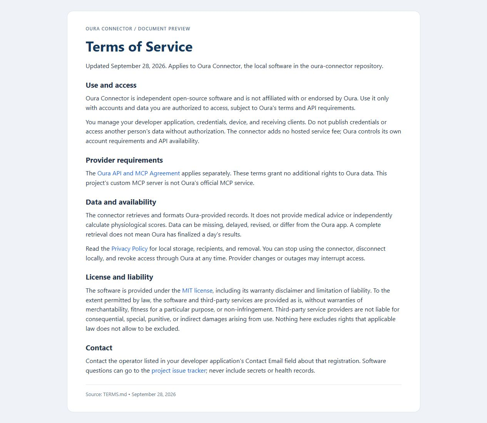

# Create your developer application

Open [Oura's developer portal](https://developer.ouraring.com/applications) and choose New Application. This guide matches the blank form supplied on September 28, 2026.

## What to enter

| Portal field | Value |
| --- | --- |
| Display Name | `Oura Connector` |
| Description | `A local, read-only app that retrieves my authorized ring data on request and presents it in a readable format. No hosted backend or persistent health-data cache.` |
| Contact Email | Your own monitored email address. This is the app operator's contact, not an API credential. |
| Website | `https://github.com/whuang214/oura-connector` |
| Privacy Policy | Public URL of this repository's [PRIVACY.md](../PRIVACY.md), once published; see below. |
| Terms of Service | Public URL of this repository's [TERMS.md](../TERMS.md), once published; see below. |
| Redirect URIs | `http://localhost:8765/callback` |

Use the existing Oura Connector name; the repository remains oura-connector. Keep the description accurate if you modify or host the software. Do not describe this project as an official Oura integration.



## The two policy URLs

Privacy explains data handling. Terms explains permitted use, availability, and software conditions. Neither field takes pasted policy text: both take an accessible page URL. The project policies describe this local software; do not substitute Oura's privacy policy for your app's policy.

Use these stable policy URLs after publishing the updated `main` branch:

```text
https://github.com/whuang214/oura-connector/blob/main/PRIVACY.md
https://github.com/whuang214/oura-connector/blob/main/TERMS.md
```

These edits are local until pushed. Do not submit the proposed URLs while they are missing, private, or showing older text. Open each while signed out and confirm the intended document is visible. Oura's acceptance of GitHub document URLs has not been verified; if the portal rejects them, publish equivalent public pages. A local screenshot or localhost policy page is not a replacement for a public policy URL.

For a fork or a different operator, use that operator's website, contact email, and policy URLs, and adjust the policy text to the actual deployment.

### Privacy Policy preview



### Terms of Service preview



## Permissions

The current connector requests these eight OAuth scopes: Daily, Heartrate, Workout, Tag, Session, SpO2, Personal, and Email. For its unchanged default configuration, select those eight in the portal. They cover daily scores and measurements, heart-rate records, workouts, tags, sessions, blood oxygen, profile details, and email respectively. Approval makes data available to requested retrievals; it does not start a bulk download.

Request only what you intend to use. For a narrower setup, edit `scopes` in the local non-secret `config.toml` to match, then sign in again. For example, omit `email` and `personal` if you do not need profile data. The default day view uses sleep, readiness, activity, stress, and SpO2; it does not need your email to label days.

Your screenshot also shows Stress, Heart Health, and Ring Configuration. The current OAuth documentation lists eight scope identifiers and does not establish identifiers for those three newer boxes. They are not automatically requested by the connector. Leave them off unless needed; coverage of those newer permissions still needs verification before promising access. Missing permissions can leave individual sections unavailable. Checking every box does not prove the connector has received every scope.

## Finish in Oura Connect

Read the provider agreement yourself before checking its agreement box or submitting registration. Once the application is created, copy its Client ID and Client Secret into the local **Oura Connect** window. Use your timezone, then choose **Save & connect with Oura**. Approve only the intended access in Oura's browser page. Never paste the secret into an issue, policy page, screenshot, or chat.


The callback URL must match exactly, including `localhost`, port, and `/callback`. If you customize it, use **Copy callback URL** in the app and register that exact value. Local HTTP is used only for the browser callback; policy and website URLs are public pages.

After sign-in, **Check connection** verifies one daily-sleep request. It does not prove every resource permission works. Closing preserves sign-in; **Disconnect** removes local OAuth tokens. The [detailed setup guide](setup.md) covers storage, revocation, CLI, and troubleshooting.

## References

Sources: the supplied portal screenshot; [official OAuth documentation](https://cloud.ouraring.com/docs/authentication); [Oura API and MCP Agreement](https://cloud.ouraring.com/legal/api-agreement). Portal UI and documentation can differ. The developer-portal link has changed; the documented OAuth authorization and token endpoints remain separate and were not changed by this update.
