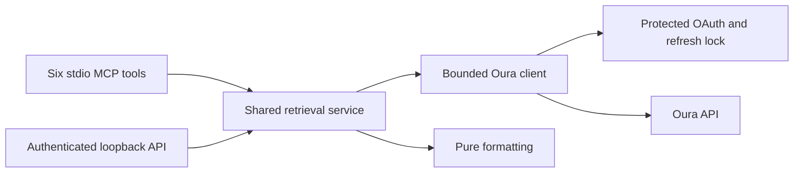

# Architecture and development

One package, one dependency lock, one service. MCP and HTTP call Python functions directly.



| File | Owns |
| --- | --- |
| `config.py` | Non-secret TOML settings and credential loading |
| `auth.py`, `auth_models.py` | Protected storage, OAuth state/PKCE, token rotation |
| `resources.py` | Names, filters, sections, fields, and units |
| `models.py` | Queries, collection outcomes, and continuation state |
| `client.py` | HTTPS, retries, byte limits, and pagination |
| `formatting.py` | Selection, units, and duration display |
| `service.py` | Day assembly, bounds, and shared public operations |
| `connection.py` | Desktop setup, session restore, verification, and disconnect |
| `interfaces/` | MCP, HTTP, CLI, and native desktop adapters |
| `tests/` | Synthetic records, mock transports, security and protocol tests |

Add a collection to the registry and test its filters/lookup. Add a day section only when records have an authoritative `day`. Neither interface needs its own retrieval logic. Configurable field selection does not evaluate arbitrary expressions.

## Verification

```powershell
uv sync --locked --extra dev
uv run --locked pytest --cov=oura_connector --cov-report=term-missing
uv run --locked ruff check .
uv run --locked mypy
uv build
```

Tests run offline and use synthetic credentials/records. They check protected storage, refresh races, forged callbacks, date boundaries, DST, partial pagination, page changes, empty versus denied, sleep formatting, HTTP security, interface parity, and a real stdio subprocess.

Live verification requires user login. Run `doctor --live`, then verify a known day and its sleep periods, especially the four date-boundary cases in [data.md](data.md). Keep real credentials and health outputs out of Git.

The package uses the maintained official MCP SDK 1.28.1 line from the previous MCP repository. FastMCP can emit an upstream pydantic-settings annotation warning with the locked dependencies; protocol tests verify operation. Package versions are ordinary metadata; there are no version-prefixed API routes or legacy compatibility layer.


## Desktop verification

The UI uses bundled Tkinter and the existing pywin32 dependency. Tomli-W saves non-secret app settings while preserving advanced values (TOML comments are not retained). Pillow is a development-only dependency for synthetic previews.

```powershell
uv run --locked python scripts/preview-ui.py --state setup --output docs/login-preview.png
uv run --locked python scripts/preview-ui.py --state saved --output docs/connection-preview.png
```

Previews never read a user profile or call Oura. Native-window tests share one Tcl interpreter and use independent Toplevel windows. UI-thread work is restricted to rendering; disk/network operations run in a worker. Test DPAPI tamper rejection, plaintext upgrade, saved-session restore, masked inputs, cancellation, and local disconnect with synthetic profiles only.
