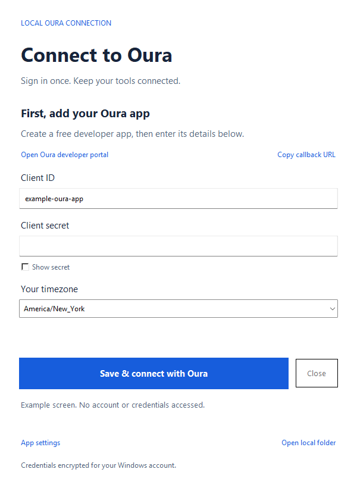

# Set up Oura Connector

Install once, connect your Oura account, then choose [MCP](mcp.md) or the [HTTP API](http-api.md). Each person runs their own copy with their own developer application and credentials.

## Install

You need Git, Python 3.11+, [uv](https://docs.astral.sh/uv/getting-started/installation/), and an Oura account eligible for API access. Use native tools for your platform. Windows x64 with Python 3.12 is verified; other platforms are not yet verified. The desktop window needs Tk; the terminal login below does not.

```powershell
git clone https://github.com/whuang214/oura-connector.git
cd oura-connector
uv sync --locked
uv run --locked oura-connector ui
```

## Create your developer app

Open [Oura's developer portal](https://developer.ouraring.com/applications) and choose **New Application**. You supply your own monitored contact email. There is no shared project OAuth app or maintainer-operated account.

| Field | Enter |
| --- | --- |
| Display Name | `Oura Connector` |
| Description | `A local, read-only app that retrieves my authorized Oura data on request.` |
| Contact Email | Your monitored email address |
| Website | `https://github.com/whuang214/oura-connector` for unmodified upstream software |
| Privacy Policy | `https://github.com/whuang214/oura-connector/blob/main/PRIVACY.md` |
| Terms of Service | `https://github.com/whuang214/oura-connector/blob/main/TERMS.md` |
| Redirect URI | `http://localhost:8765/callback` |

The redirect must exactly match the app's **Copy callback URL** value, including hostname, port, and path. If you customize it, register that exact value instead.


Read the provider agreement before checking its agreement box and submitting. The policy links describe this unmodified local software. Review them against your installation; modified or hosted deployments need their own accurate policies and contact details. Public availability of a URL does not guarantee Oura will accept it. If GitHub document URLs are rejected, publish equivalent public pages. Local files and screenshots do not replace public policy URLs.

The [Privacy Policy](../../PRIVACY.md) and [Terms](../../TERMS.md) explain responsibilities and data handling. For reference, [privacy](../assets/privacy-policy.png) and [terms](../assets/terms-of-service.png) previews are available. You operate your installation; the maintainer publishes the code.

## Permissions

The unchanged configuration requests eight OAuth scopes: Daily, Heartrate, Workout, Tag, Session, SpO2, Personal, and Email. Select those eight for that configuration. For narrower access, choose only the categories you need and change `scopes` in your non-secret settings to match before authorizing again.

| Scope | Data category |
| --- | --- |
| `daily` | Daily sleep, activity, and readiness summaries |
| `heartrate` | Heart-rate time series |
| `workout` | Workouts |
| `tag` | User-entered tags |
| `session` | Guided and unguided sessions |
| `spo2` | Sleep blood oxygen summary |
| `personal` | Personal profile |
| `email` | Account email |

The supplied portal screenshot also shows Stress, Heart Health, and Ring Configuration. Their exact new OAuth identifiers and live coverage have not been verified; the connector does not add guessed scope names. Additional sections may be unavailable until the appropriate access is established. Checking a portal box alone does not prove a grant was received. The [configuration reference](../reference/configuration.md) explains how to choose scopes; [Oura's OAuth reference](https://cloud.ouraring.com/docs/authentication) is the provider source.

## Sign in

Copy your application's Client ID and Client Secret into **Oura Connect**, choose your timezone, and select **Save & connect with Oura**. Sign in and approve the intended permissions on Oura's browser page. Never share the secret in screenshots, issues, or chats.



Your Oura password stays in the browser. Credentials are saved locally. Closing the window preserves sign-in; reopening restores the saved view. **Check connection** tests one daily-sleep request; stored credentials alone do not establish a live connection.

On Windows, optionally create the desktop shortcut:

```powershell
pwsh -NoProfile -File scripts/create-shortcut.ps1
```

The shortcut opens Oura Connect without a console. It uses PowerShell 7 (`pwsh`). The normal `uv run --locked oura-connector ui` command works without that shortcut.

## Terminal login

After creating your developer app:

```powershell
uv run --locked oura-connector setup --timezone America/New_York
uv run --locked oura-connector login
uv run --locked oura-connector doctor --live
```

Use your own IANA timezone. Setup prompts for the client ID and secret. Login opens Oura in the browser and waits up to three minutes for its callback. CLI setup refuses to overwrite existing configuration; use the desktop settings to update app details.

The live probe prints status rather than health records. An empty successful result still verifies that collection. It does not verify every permission. Then follow [MCP](mcp.md) or [HTTP API](http-api.md) to make a first request.

## Local files

Default directory: `%LOCALAPPDATA%/oura-connector` on Windows, or `$XDG_CONFIG_HOME/oura-connector` (default `~/.config/oura-connector`) elsewhere. Files are outside the repository. No `.env` file is read or imported.

| File | Purpose |
| --- | --- |
| `config.toml` | Non-secret client ID, callback, timezone, formatting, and limits |
| `credentials.json` | Client secret and local HTTP bearer token |
| `tokens.json` | Rotating Oura OAuth credentials |
| `tokens.json.lock` | Cross-process refresh coordination |
| `tokens.json.oauth-session` | Temporary state and PKCE verifier |

Windows secret files use DPAPI CurrentUser encryption and restrictive permissions. Programs running as your Windows account can still access them. Other platforms use owner-only permissions without application encryption. The desktop app upgrades protected plaintext saves from the earlier CLI to DPAPI on Windows. Reconfigure on a different account/computer instead of copying encrypted files.

For a custom profile, put `--config C:/path/to/config.toml` before the CLI subcommand. Credentials live beside that TOML file. The [configuration reference](../reference/configuration.md) owns supported settings and customization.

## Disconnect or switch apps

**Disconnect** removes the saved local OAuth token file. It keeps the client ID, client secret, and settings; it does not delete Oura records or revoke access at Oura. In-flight requests may finish; later requests need sign-in again. To switch developer apps, disconnect, update the app details, and authorize again. Restart existing MCP/HTTP processes after changing settings.

For full provider revocation, remove the application's access through Oura. To remove all local setup, stop connector processes and remove your profile directory. Delete retained exports or conversations separately in the clients that created them. The maintainer cannot delete files on your computer or data at Oura.

Problems? Continue to [troubleshooting](troubleshooting.md).
